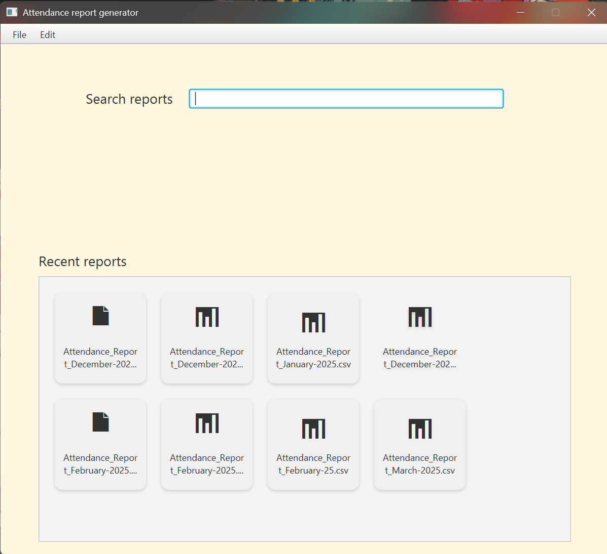
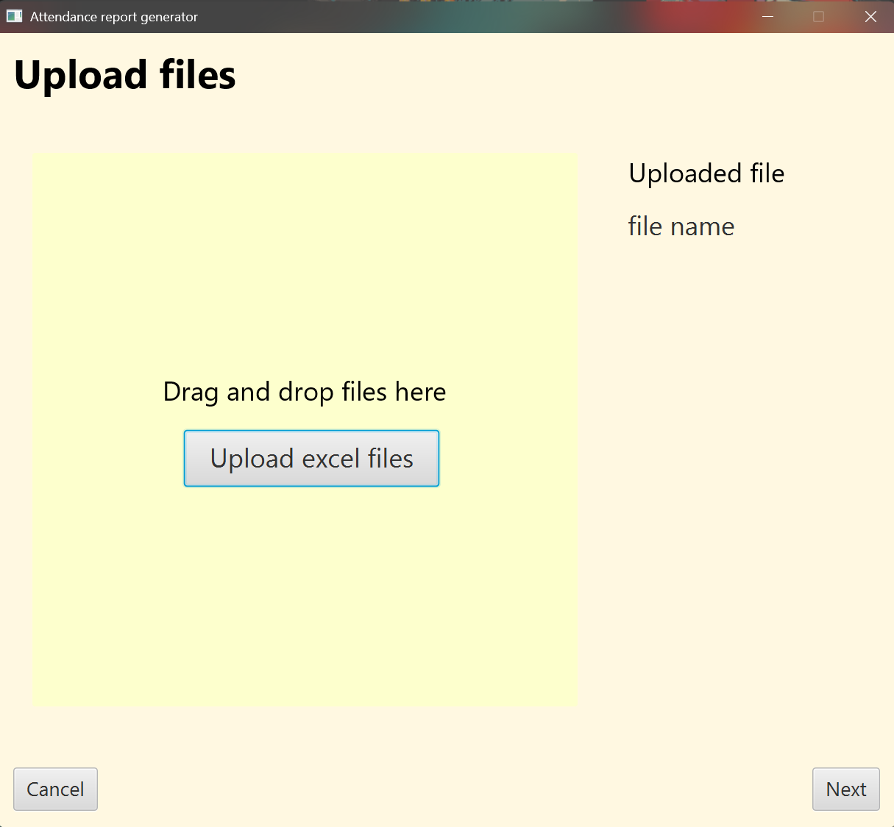
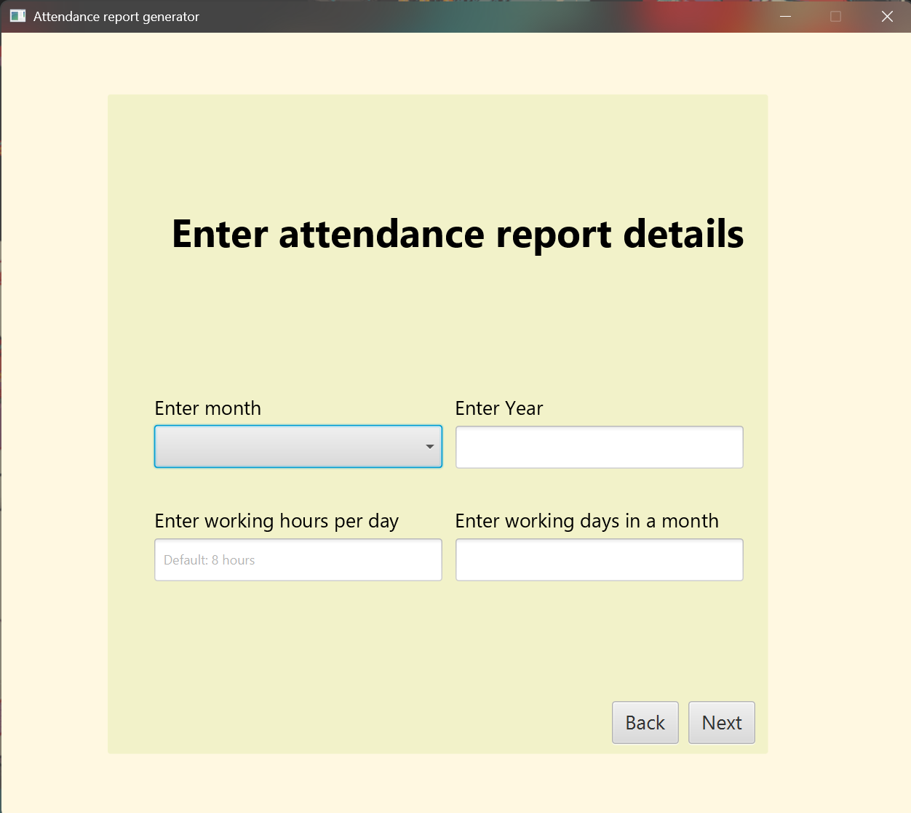
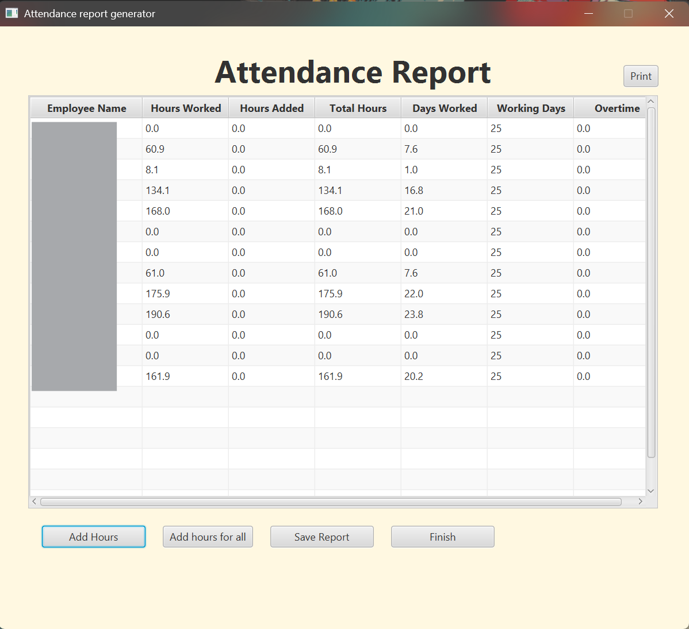

# Employee Attendance Report Generator

## 🆕 Latest Releases
Download the latest version of the Employee Attendance Report Generator from the  
[Releases](https://github.com/Aryan214G/attendance-report-generator/releases) page.

---
## 📸 Application Screenshots

  
  
  
  

---

## 📦 Installation Guide

1. Download the latest `.exe` installer from the **Releases** section.
2. Run the installer and follow the setup prompts.
3. After installation, you can launch **Employee Attendance Report Generator** from:
    - The **Start Menu**
    - The **Desktop shortcut**
    - Or by navigating to the installation directory and launching the `.exe` manually  
      *(You can pin it to your Taskbar or Start Menu for quick access.)*

---

## 📂 Example Excel Template

To ensure your attendance data uploads correctly, please follow these steps:

1. Download the example Excel template from the **Assets** section of the latest release.
2. Enter your employee attendance timestamps following the rules below.
3. Save the file as:  
   **`.xlsx` (Excel Workbook)**  
   before uploading it into the application.

---

## ⏱ Timestamp Format Guide

Your Excel file must have **timestamps** in the format:

HH:mm

### Night Shift Example (Requires proper before/after midnight timestamps)

00:02
07:05
19:02
23:58

### Regular Day Shift Example

07:39
17:10

The application automatically detects:

- Normal day sessions
- Dual-session night shifts
- Incomplete timestamps (Could lead to incorrect reports)
- Morning and night boundaries
- Closest-to-noon checkout times for night shifts

---

## 🧠 Feedback & Contributions
Have an idea for a new feature or found a bug?  
Please [open an issue](https://github.com/Aryan214G/attendance-report-generator/issues/new/choose).

---